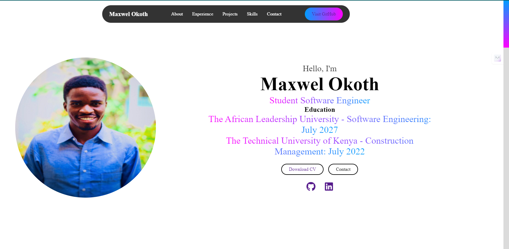
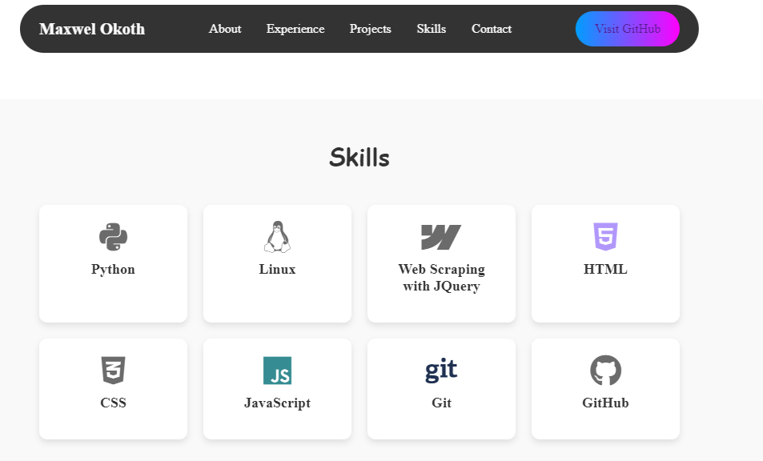

# Maxwel Okoth Resume Website

This is a personal resume website built using HTML, CSS, and JavaScript. It showcases my skills, experience, education, and recent projects. The website is fully responsive and designed to give a brief introduction about me.

## Table of Contents

- [About](#about)
- [Experience](#experience)
- [Projects](#projects)
- [Skills](#skills)
- [Contact](#contact)
- [Screenshots](#screenshots)
- [Installation](#installation)
- [Features](#features)

## About

The **About** section provides an introduction to who I am, my education background, and some links to my social profiles.

## Experience

Lists my previous work experience, including positions such as Social Media Manager, Community Facilitator, and more.

## Projects

Highlights my recent projects:

- **Digital Business Card**
- **Registration Form**
- **Basic Weather App**

## Skills

Features my core technical skills, including Python, HTML, CSS, JavaScript, Git, and GitHub.

## Contact

You can contact me via email through the contact form.

## Screenshots

### Home Page



### Skills Section



## Installation

1. Clone the repository:
   ```bash
   git clone https://github.com/Maaxboon/resume-website.git
   ```
2. Open `index.html` in your browser.

## Features

- Fully responsive design
- Interactive navigation
- Includes projects with live demo links
- Contact form
